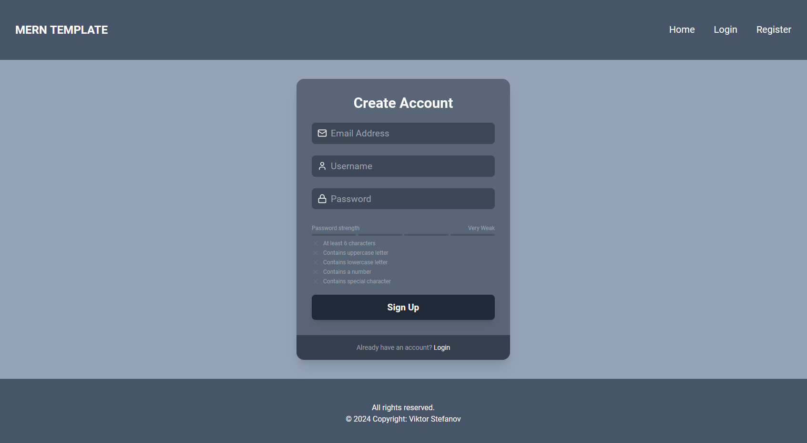
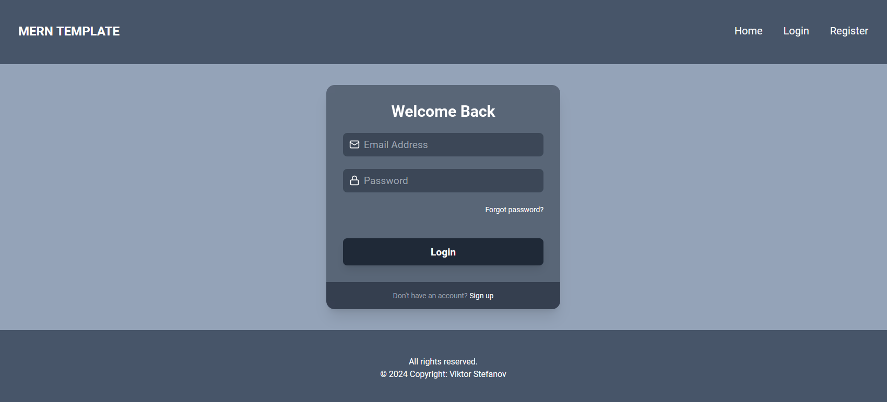
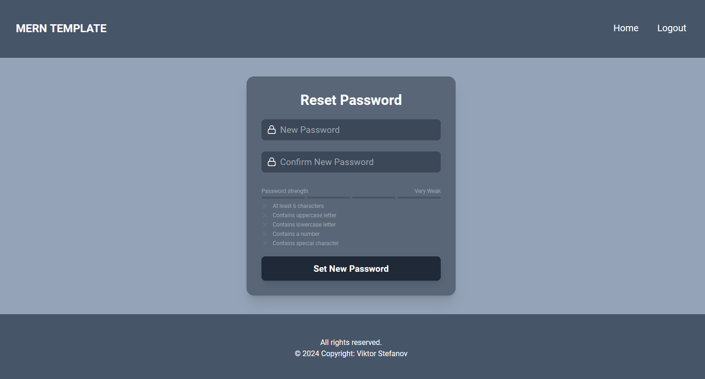
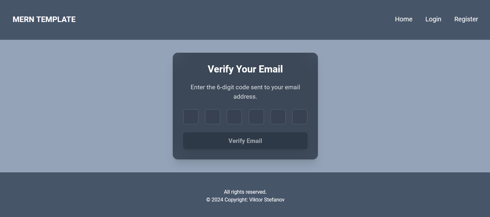
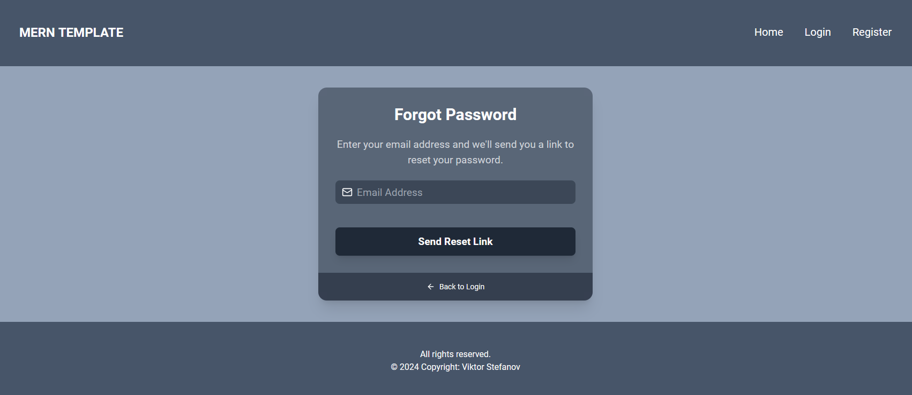

# Full-Stack Web Application - MERN Boilerplate (TypeScript, Express, MongoDB, React)

This repository contains a full-stack web application with the following technologies:

- **Server**: RESTful API built using TypeScript, Express, and MongoDB.
- **Client**: Front-end application built using React(TypeScript).

#### Front-end:
<p align="left">
  <a>
    
  </a>
</p>

#### Back-end:
<p align="left">
  <a>
    
  </a>
</p>

## Overview <a name="overview"></a>

This repository contains a RESTful API built using TypeScript, Express, and MongoDB. The project structure is designed to be scalable, modular, and easy to maintain. It includes all the necessary features such as routing, middleware, database operations,services and more.Also has front-end application built with React(TypeScript) and Redux for state managment.

## Authentication <a name="authentication"></a>

This project includes a comprehensive authentication system implemented on both the server and client sides. The server handles user authentication and authorization through JWT (JSON Web Tokens), bcrypt for password hashing, and secure token management using cookies. The front-end incorporates Redux for managing authentication state and Axios for API requests related to user login, registration, and other authentication-related operations.

## Table of Contents

1. [Overview](#overview)
2. [Authentication](#authentication)
3. [Features](#features)
   - [Back-End](#back-end)
   - [Front-End](#front-end)
4. [Getting Started](#getting-started)
   - [Clone Repository](#clone)
   - [Installation](#install)
   - [Run the Project](#run)
5. [API Endpoints](#endpoints)
6. [Local Development Setup](#environments)
7. [Front-End Views](#front-views)


## Features <a name="features"></a>

### Back-End (API) <a name="back-end"></a>

- **TypeScript** [5.5.4] for static typing.
- **Express** [4.19.2] as the Node.js web framework.
- **MongoDB** with **Mongoose** [8.6.0] as database.
- **JWT Authentication** [9.0.2] for authenticating and authorizing users, with the token stored securely in cookies using cookie-parser library.
- **Bcrypt** [2.4.3] for hashing and securing user passwords.
- **Crypto** [1.0.1] module is used to generate a random token for the password reset process.
- **Joi** [17.13.3] validation to ensure that the data submitted in HTTP requests conforms to expected formats, constraints, and types before it reaches the application logic.
- **TS-node** [10.9.2] to run TypeScript code directly in Node.js.

### Front-End <a name="front-end"></a>

 - **TypeScript** [5.5.3] for static typing.
 - **Redux Toolkit** [2.2.7] state management.
 - **TailwindCSS** [3.4.10] styling and layout.
 - **React Router** [6.26.1] for client-side routing.
 - **Axios** [1.7.7] to handle API requests.
 - **React-toastify** [10.0.5] displaying notifications.
 - **Framer-motion** [11.3.31] adding animations and transitions to components.
 - **Formik** [2.4.6] for managing forms.
 - **Yup** [1.4.0] validating form inputs and data.
 - **Lucide-react** [0.438.0] icons.
 - **React-spinners** [0.14.1] for Loader component.

## Getting Started <a name="getting-started"></a>

### 1. Clone the repository <a name="clone"></a>

```sh
    git clone https://github.com/viiktorstefanov/mern-boiler-plate.git
```

### 2. Install dependencies <a name="install"></a>

```bash
Install dependencies

2.Navigate to both the server and client directories and install their dependencies:


# In the root directory
cd server
npm install

# Now install client dependencies
cd ../client
npm install 
```

### 3. Run the project <a name="run"></a>

```bash
npm run dev 
for both server and client
```

## API Endpoints  <a name="endpoints"></a>

### **GET /api/auth**

- **Description**: Check if the user's token is valid and retrieve user details
- **Responses**:
  - **200 OK**: Returns the user details: { success: true, user: user details}
  - **400 Bad Request**: Problem with finding user: { success: false, message: error.message }
  - **401 Unauthorized**: Invalid or expired token: { success: false, message: error.message }
  - **500 Internal Server Error**: Server error: { success: false, message: error.message }

### **POST /api/auth/login**

- **Description**: handles user authentication by validating login credentials (email and password). It checks the provided credentials against the database, verifies the password, and generates a token upon successful authentication. The token is then stored in cookies for further authentication.
- **Responses**:
  - **200 OK**: Returns the user details: { sucess: true, message: 'Logged in successfully', user: user details }
  - **400 Bad Request**: The request body is invalid, or the credentials provided (email/password) are incorrect: {
  "success": false,
  "message": error.message
}
  - **500 Internal Server Error**: An unexpected error occurred during login, or a database operation failed. { success: false, message: error.message }

### **POST /api/auth/signup**

- **Description**: handles user registration by creating a new user in the system. It checks if the email is already registered, hashes the password, and generates a verification token. Upon successful registration, the system creates a token and stores it in cookies for future authentication.
- **Responses**:
  - **201 OK**: User successfully registered: { sucess: true, message: 'User successfully registered.', user: user details }
  - **400 Bad Request**: The request contains invalid data, such as an existing email or failed validation: { "success": false, "message": error.message }
  - **500 Internal Server Error**: An unexpected error occurred during login, or a database operation failed. { success: false, message: error.message }

### **POST /api/auth/logout**

- **Description**: handles user logout by clearing the token stored in cookies.
- **Responses**:
  - **201 OK**: User successfully logged out: { "success": true, "message": "Logged out successfully" }
  - **400 Bad Request**: No token found in the cookies: { "success": false, "message": error.message }
  - **500 Internal Server Error**: An unexpected error occurred during login, or a database operation failed. { success: false, message: error.message }

### **POST /api/auth/reset-password/:token**

- **Description**: handles password reset functionality. Users provide a valid reset token (sent to them via email) and a new password. The token is validated to ensure it hasn’t expired. If valid, the user's password is updated, and a success email is sent to the user.
- **Responses**:
  - **200 OK**: Password successfully reset, and an email is sent to the user: { "success": true, "message": "Password reset successful" }
  - **400 Bad Request**: The request body is invalid, the reset token is invalid or expired, or some other validation issue occurred: { "success": false, "message": error.message }
  - **500 Internal Server Error**: An unexpected error occurred during login, or a database operation failed. { success: false, message: error.message }

### **POST /api/auth/verify-email**

- **Description**: verifies a user's email using a verification code. The code is checked against the database, ensuring it hasn’t expired. If the code is valid, the user's email is marked as verified, and a welcome email is sent. The user’s verification token is then cleared.
- **Responses**:
  - **201 OK**: Email successfully verified: { "success": true, "message": "Email verified successfully" }
  - **400 Bad Request**: The verification code is invalid or has expired, or the request body fails validation: { "success": false, "message": error.message }
  - **500 Internal Server Error**: An unexpected error occurred during login, or a database operation failed: { success: false, message: error.message }

### **POST /api/auth/forgot-password**

- **Description**: handles the password recovery process. When a user forgets their password, they can provide their email address. If the email exists in the system, a password reset token is generated and sent to their email, allowing them to reset their password. The token is valid for 1 hour.
- **Responses**:
  - **201 OK**: Password reset link successfully sent to the user's email.: { "success": true, "message": "Password reset link sent to your email" }
  - **400 Bad Request**:  The email is invalid, not found in the system, or the request fails validation.: { "success": false, "message": error.message }
  - **500 Internal Server Error**: An unexpected error occurred during login, or a database operation failed. { success: false, message: error.message }

## Local Development Setup - Environment <a name="environments"></a>

- PORT=5000
- HOST=http://localhost:5000
- MONGODB_URL=mongodb://127.0.0.1:27017/example
- JWT_SECRET=ex@mplePa$$w0rD2024

## Front-End <a name="front-views"></a>

### Register


### Login


### Reset Password


### Verify Email


### Forgot Password
